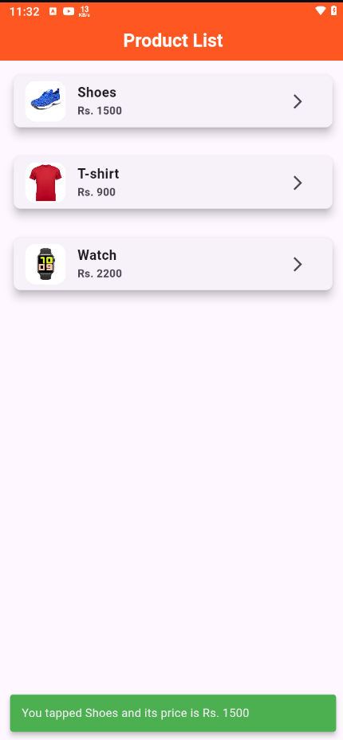

# 🛍️ Flutter Product List App

A simple Flutter app that displays a list of products with their images and prices. Users can tap a product to view its price in a snackbar.

## 💻 Demonstration of my project


## 🖼️ Screen 1 with products list


## 🖼️ Screen 2 with snack bar feedback




---

## 📱 Features

- 📦 Displays product cards with images, titles, and prices
- 📲 Tapping a product shows its price in a Snackbar
- 🎨 Clean and responsive UI using Flutter widgets
- 📁 Organized project structure for scalability
- 🏛️ DRY code to improve app efficiency

---

## 🚀 Getting Started

To run this project locally:

```bash
git clone https://github.com/your-username/product-list-app.git
cd product-list-app
flutter pub get
flutter run
